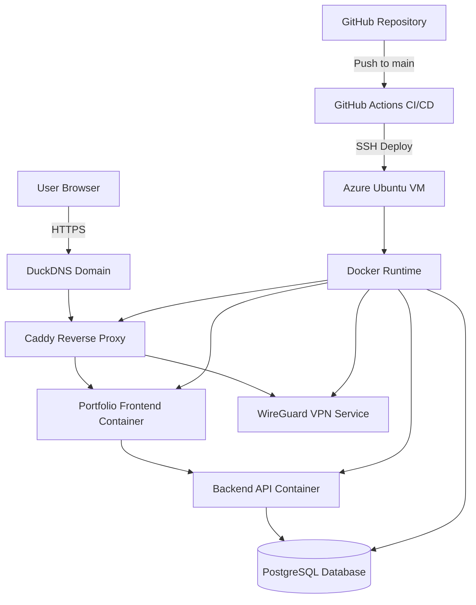

# Cloud Architecture

This project is deployed using a containerized production stack running on a Microsoft Azure Ubuntu virtual machine.

The infrastructure uses Docker containers, a Caddy reverse proxy, GitHub Actions CI/CD, and DuckDNS domain routing.

