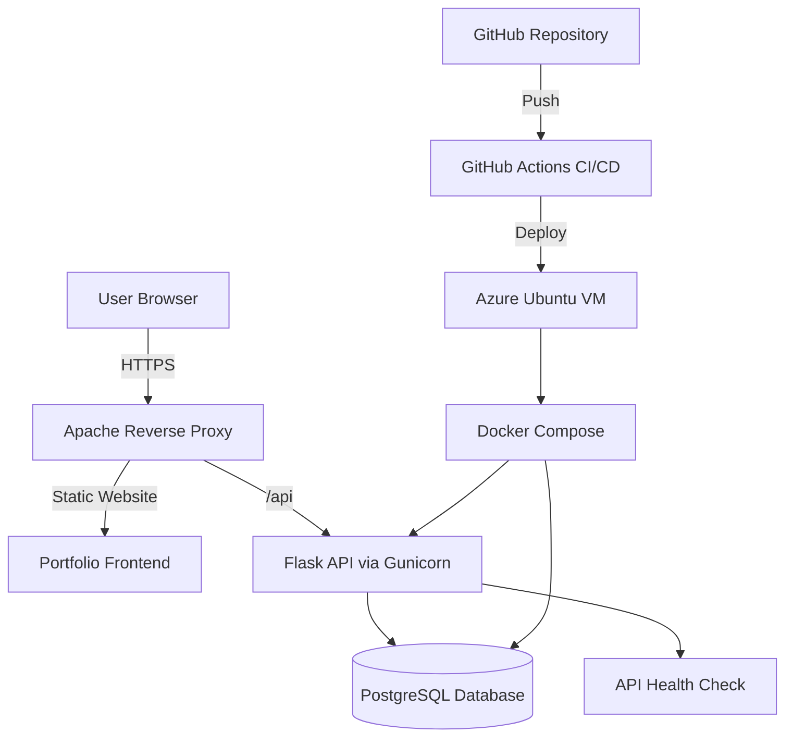

# Greg Forward Cloud Portfolio

**Live Site:**
https://gregforward.duckdns.org

---

# Overview

This project is a production-style cloud portfolio deployed on an Azure Ubuntu virtual machine.

It demonstrates practical **cloud infrastructure and DevOps concepts** including:

* reverse proxy architecture
* HTTPS security
* containerized backend services
* API deployment
* PostgreSQL database integration
* CI/CD automation
* live monitoring

The project is designed to simulate a **real-world production deployment environment**.

---

# Architecture

This system uses **Apache as the public HTTPS gateway**, which serves the frontend portfolio and reverse proxies API requests to a **Flask backend running with Gunicorn**.

The backend communicates with a **PostgreSQL database** for persistent s
