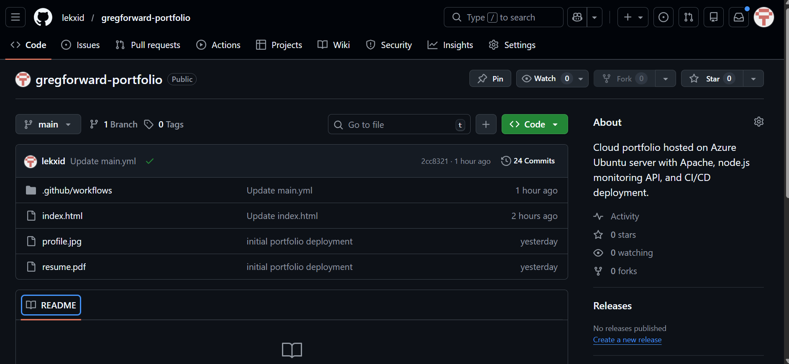

---

# Infrastructure Stack

**Cloud Provider**

Microsoft Azure Ubuntu VM

**Containerization**

Docker  
Docker Compose

**Networking**

Caddy Reverse Proxy  
DuckDNS Domain Routing  
WireGuard VPN

**Backend Services**

Python Flask API  
Gunicorn WSGI server  
PostgreSQL Database

**DevOps**

GitHub Actions CI/CD  
Git Version Control  
Automated deployments

---

# Key Features

Live HTTPS Cloud Portfolio

Containerized production infrastructure

Reverse proxy domain routing

Secure VPN deployment

Backend API services

Database-connected architecture

Continuous deployment workflow

---

# Screenshots

## Cloud Architecture

---

# Projects Included

## Azure Cloud Portfolio Server

Production cloud environment hosted on Azure using Docker containers and reverse proxy routing.

## WireGuard VPN Deployment

Secure VPN service deployed with domain access and container isolation.

## Backend API Infrastructure

REST API built using Flask and deployed with Gunicorn inside Docker.

## CI/CD Pipeline

GitHub-based workflow used to deploy updates from the repository to the cloud server.

---

# Skills Demonstrated

Cloud Infrastructure Engineering

Linux Server Administration

Containerization with Docker

Reverse Proxy Networking

DevOps Deployment Pipelines

Backend API Development

Database Integration

VPN Networking

---

# Contact

Adeleke Gregory Ajayi

LinkedIn  
https://www.linkedin.com/in/gregory-ajayi

GitHub  
https://github.com/lekxid

Email  
adelekeajayi001@gmail.com

---

# Portfolio Status

Infrastructure Status: **Online**

Stack:  
Azure VM + Docker + Caddy + Backend API + HTTPS + CI/CD

This project is actively maintained and used as a personal cloud engineering lab.
